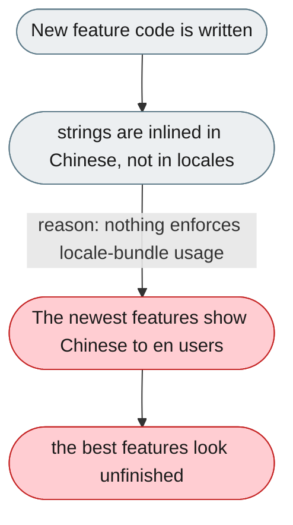
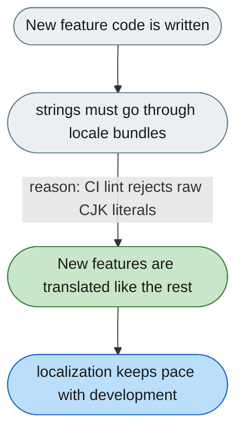

---

# The newest features are the least translated

*Concern: Language*

---

## The problem today

About 366 Chinese string literals sit outside the locale bundles, clustered in recent work (trajectory, code mode, team area, slash registry). The differentiating features therefore read as untranslated.

---

## The proposed fix

Move the inlined literals into the locale bundles, and add a lint check that fails CI on raw CJK string literals in UI/feature source so new code cannot reintroduce them.

