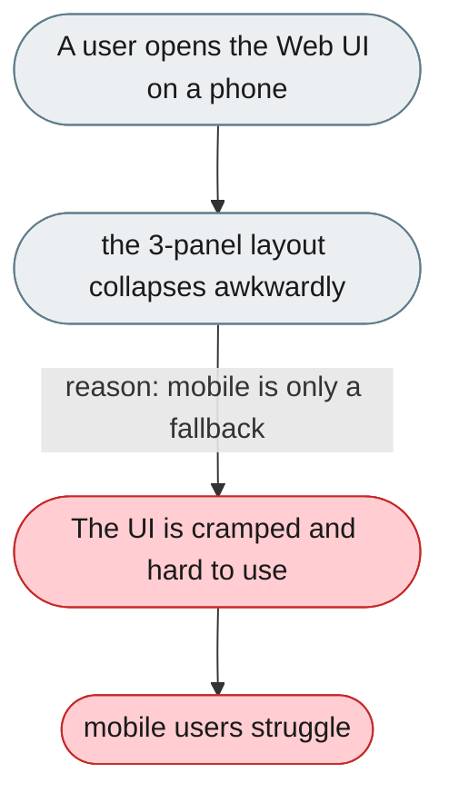
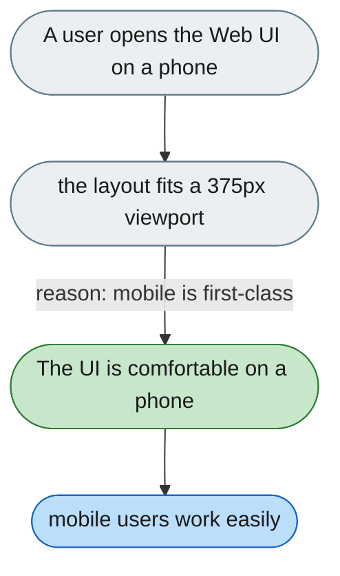

---

# The web UI isn't usable as a proper mobile experience

*Concern: Mobile & Cross-Device*

---

## The problem today

`useResponsive.ts` has breakpoints, but the 3-panel architecture collapses poorly on a 375px screen.

---

## The proposed fix

Treat mobile as a real use case: input docked to the bottom, conversation fills the viewport, panels open via a bottom sheet or drawer on a 375px screen.

