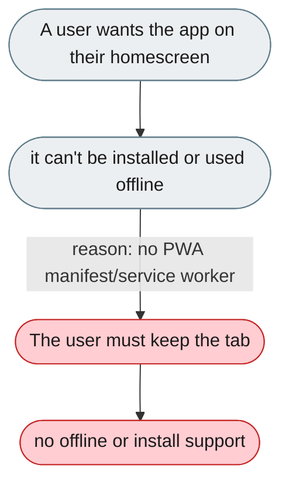
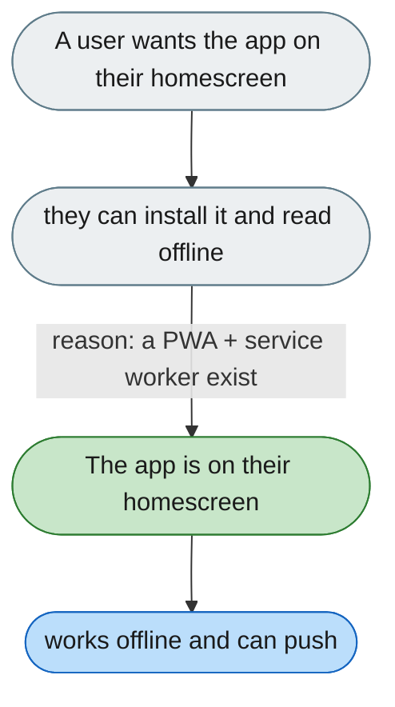

---

# No installable or offline (PWA) version

*Concern: Mobile & Cross-Device*

---

## The problem today

The Web UI is a standard SPA — no manifest, no service worker, no offline or install-to-homescreen support.

---

## The proposed fix

A PWA manifest to install to the homescreen, a service worker for offline reads and queued sends, and push for task completion.

