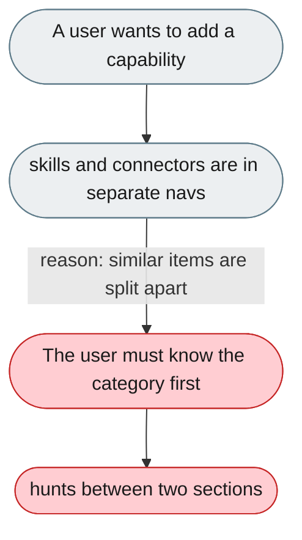
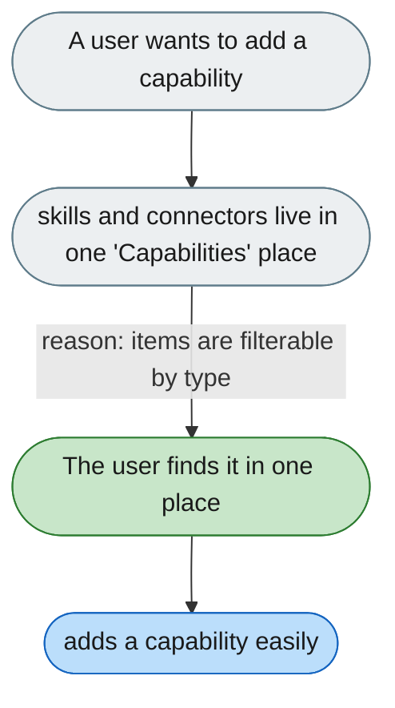

---

# Skills and connectors are split apart though they're the same kind of thing

*Concern: Navigation & Settings*

---

## The problem today

`SessionSidebar` lists "Skills" and "Connector Market" (plugins, MCP) as separate top-level sections, though both extend agent capabilities.

---

## The proposed fix

A unified "Capabilities" section — skills, MCP servers, plugins, and browser tools in one place, filterable by type — so adding a capability needs no category knowledge.

