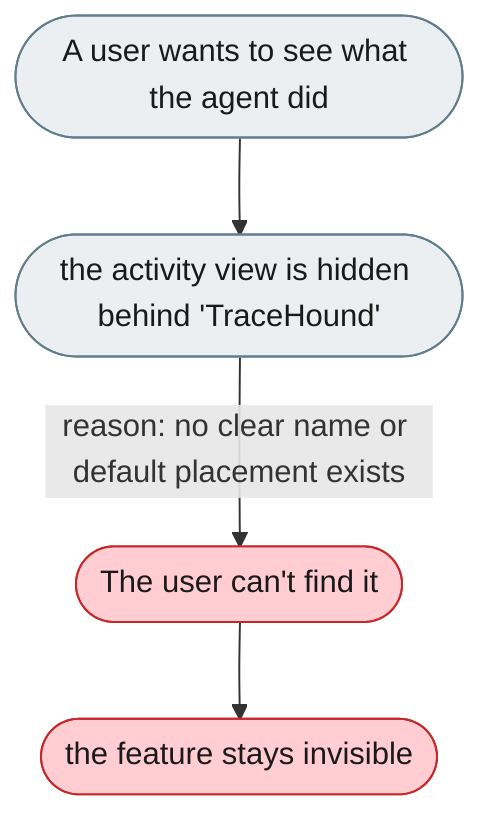
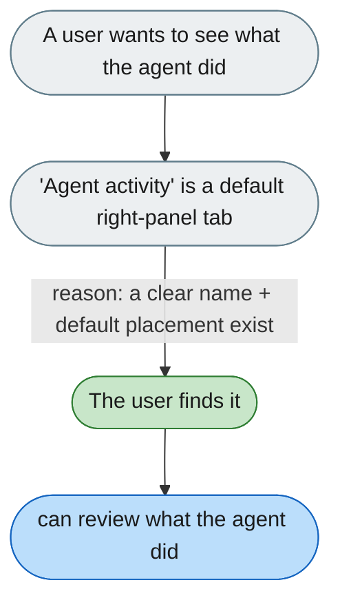

---

# The activity view is hidden behind an unclear name

*Concern: Navigation & Settings*

---

## The problem today

The trajectory system lives in the right panel but needs knowing to look for it, and its nav item is labeled "TraceHound" — meaningless to a new user.

---

## The proposed fix

Rename to "Agent activity" (or "What happened") and surface it as a default sub-tab in the right panel. Related: [Agent reasoning is hidden in a separate panel](../../../../web-user-code/findings/conversation/explanation/1-agent-reasoning-is-hidden-in-a-separate-panel.md).

