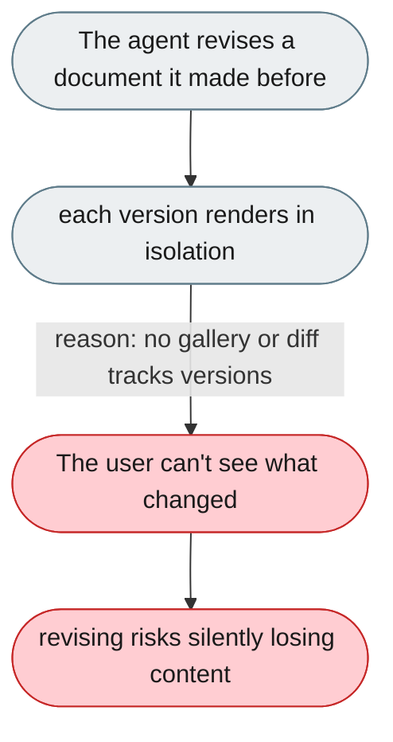
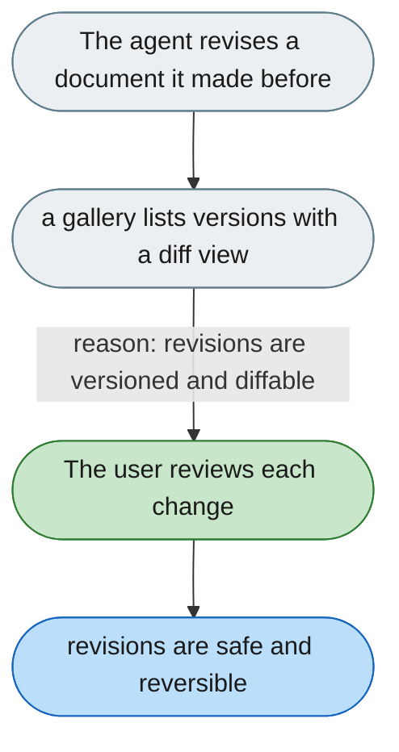

---

# Can't compare versions of a generated artifact

*Concern: Safety & Undo*

---

## The problem today

Artifacts render one at a time, with no gallery and no version-to-version diff when the agent revises the same document.

---

## The proposed fix

Keep every revision of an artifact and add a gallery view plus a version-to-version diff, so the user can compare any two revisions and see exactly what the agent changed.

