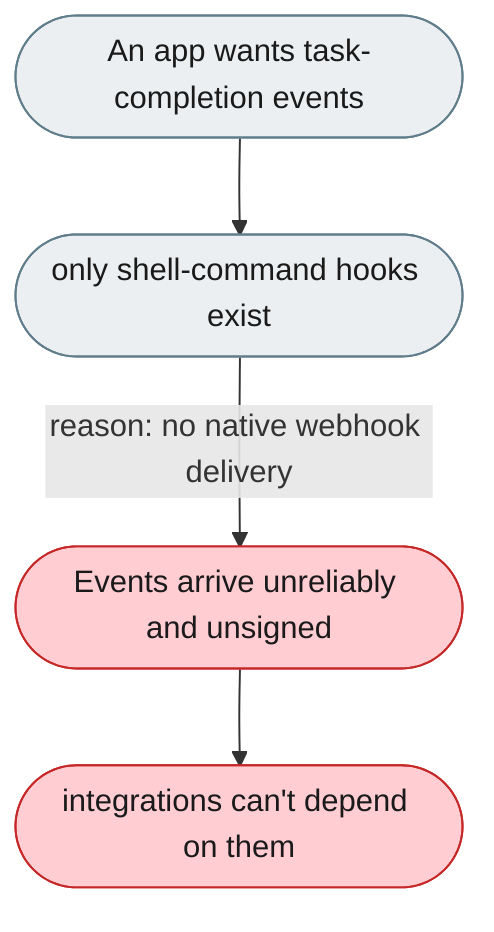
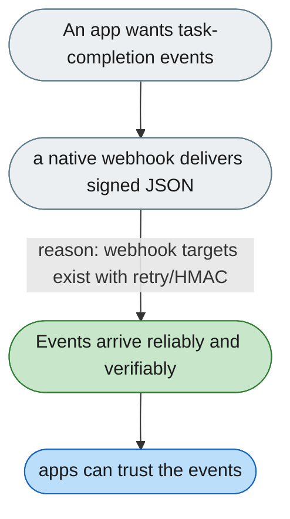

---

# Only shell-command hooks exist; there's no real webhook delivery

*Concern: Integration & Local Development*

---

## The problem today

Hooks only fire shell commands (e.g. `curl`), so there's no native HTTP webhook — no retry, no delivery guarantee, no HMAC, and no events for task completion, tool calls, errors, or stream start/end.

---

## The proposed fix

A native webhook destination in config (`on_task_complete`, `on_agent_error`, …) with HMAC-SHA256 signature, retry, timeout, and a structured JSON payload.

