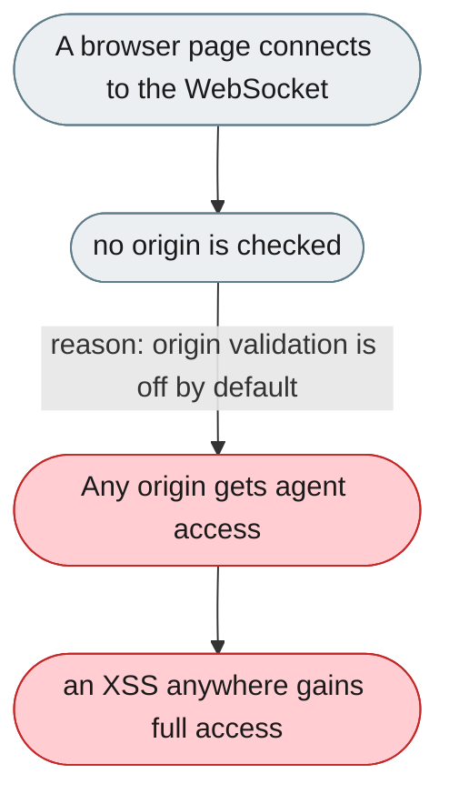
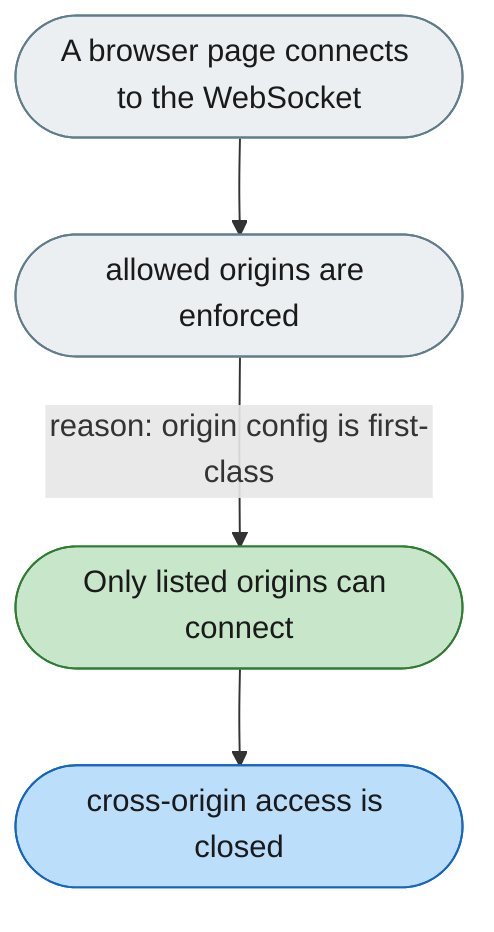

---

# WebSocket origin checks are off by default and undocumented

*Concern: Connection Security*

---

## The problem today

Origin validation is controlled by two undocumented env vars and is off by default — any origin can connect, so an XSS on any co-served page gets unrestricted WebSocket access.

---

## The proposed fix

Promote `allowed_origins` to config.yaml and print a startup warning when it's unset and the server isn't loopback-bound.

