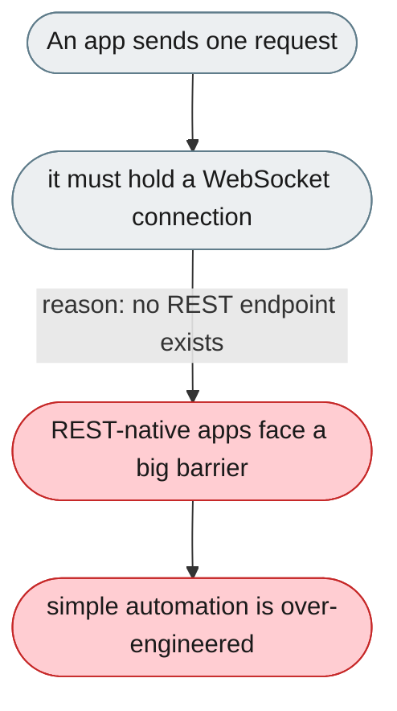
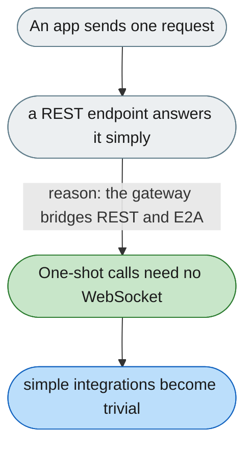

---

# External apps can only reach the agent over WebSocket, with no REST

*Concern: Transport & Protocol*

---

## The problem today

jiuwenswarm's external interface is E2A over WebSocket only — there is no HTTP REST API, so even a one-shot request needs full WebSocket machinery (async, reconnect, multiplexing).

---

## The proposed fix

A thin REST wrapper for single-shot cases: `POST /api/chat`, `GET /api/sessions`, `GET /api/sessions/:id/history` — the gateway translates REST into E2A; WebSocket stays for streaming.

