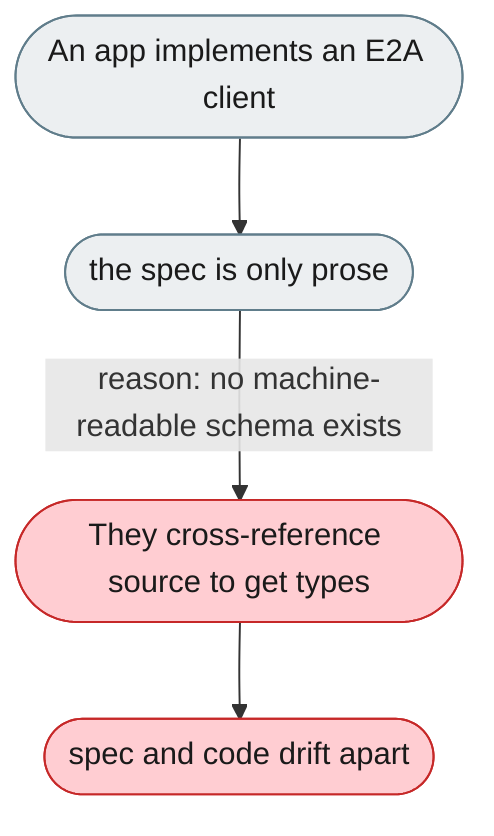
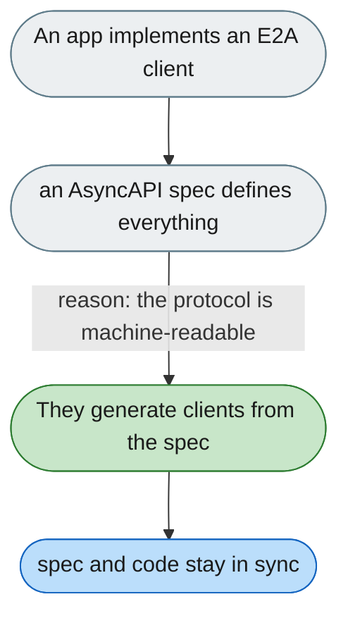

---

# The E2A protocol spec is prose, not a machine-readable schema

*Concern: Transport & Protocol*

---

## The problem today

The E2A spec lives in two Markdown files with no JSON Schema, AsyncAPI spec, or type stubs — clients must cross-reference prose against the source dataclasses, and there's no structured changelog.

---

## The proposed fix

An AsyncAPI 3.0 spec (`e2a-asyncapi.yaml`) describing schemas, methods, error codes, and streaming — usable to auto-generate SDKs and the ground truth that prevents drift.

