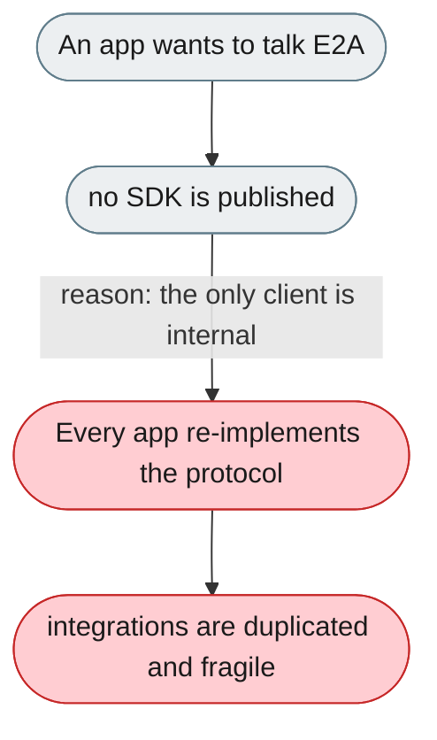
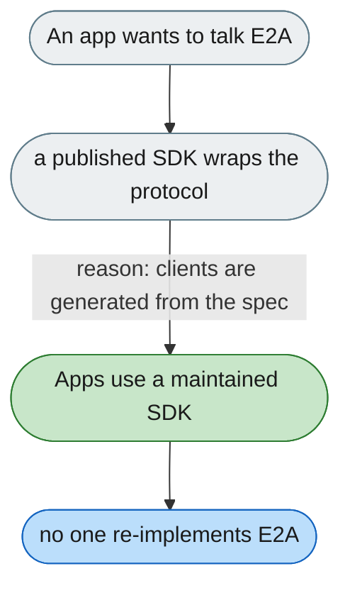

---

# No published client SDK, so every app re-implements the protocol

*Concern: Transport & Protocol*

---

## The problem today

The only client (`WebSocketAgentServerClient`) is internal and unpublished; every external app must copy it or implement E2A from scratch, and JS/TS has no reference at all.

---

## The proposed fix

Publish `jiuwenswarm-client` (PyPI) and `@jiuwenswarm/client` (npm), generated from the [E2A AsyncAPI spec](2-the-e2a-protocol-spec-is-prose-not-a-machine-readable-schema.md) so they stay in sync.

