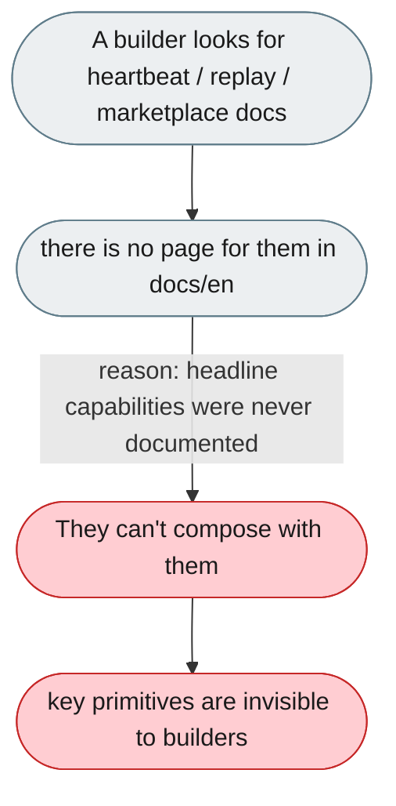
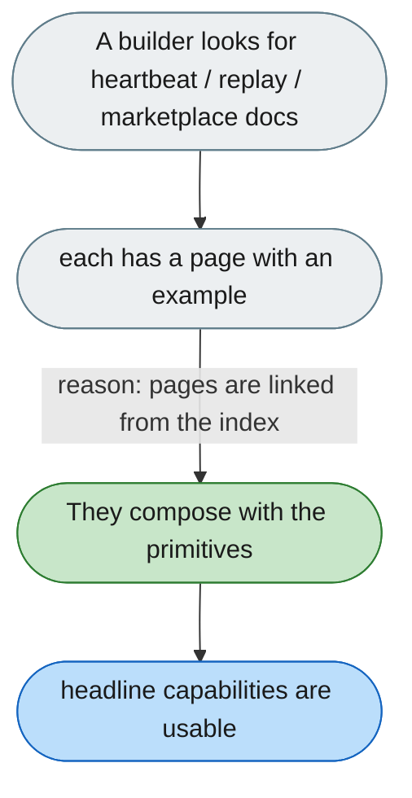

---

# Headline capabilities ship undocumented

*Concern: Documentation*

---

## The problem today

Heartbeat, trajectory replay and the connector marketplace have no page in `docs/en` — exactly the primitives a builder composes with (scheduling, run forensics, distributing a plugin).

---

## The proposed fix

Write a page for each capability (heartbeat/scheduling, trajectory replay, connector marketplace) with what it does, how to enable it and a worked example, and link them from the docs index so they are discoverable.

