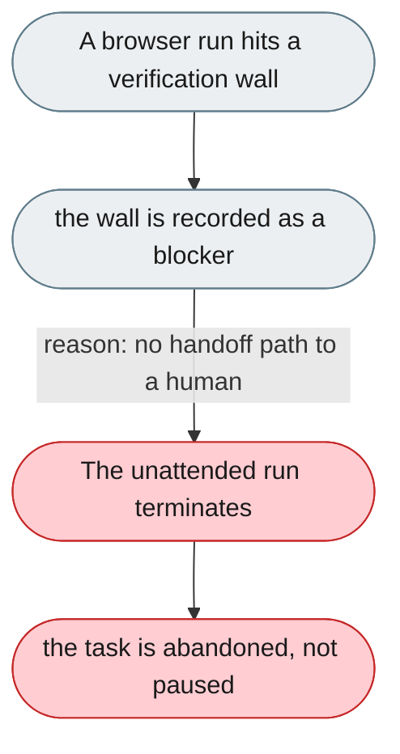
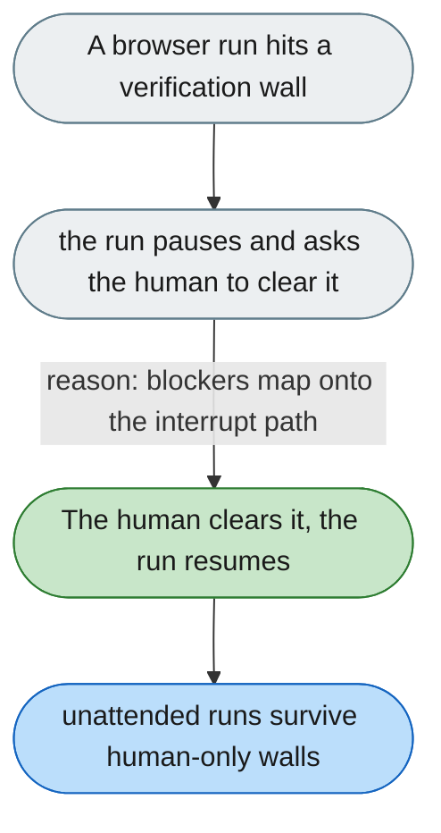

---

# Browser runs stop at a blocker with nowhere to go

*Concern: Integration & Tooling*

---

## The problem today

agent-core detects verification walls and records them as blockers, but there is no human handoff. An unattended run simply dies instead of pausing for a person to clear the blocker.

---

## The proposed fix

Route a detected blocker to a human via the existing interrupt/approval mechanism: pause the run, surface the wall (CAPTCHA, login, interstitial) with a "take over" prompt, and resume from the same step once cleared.

