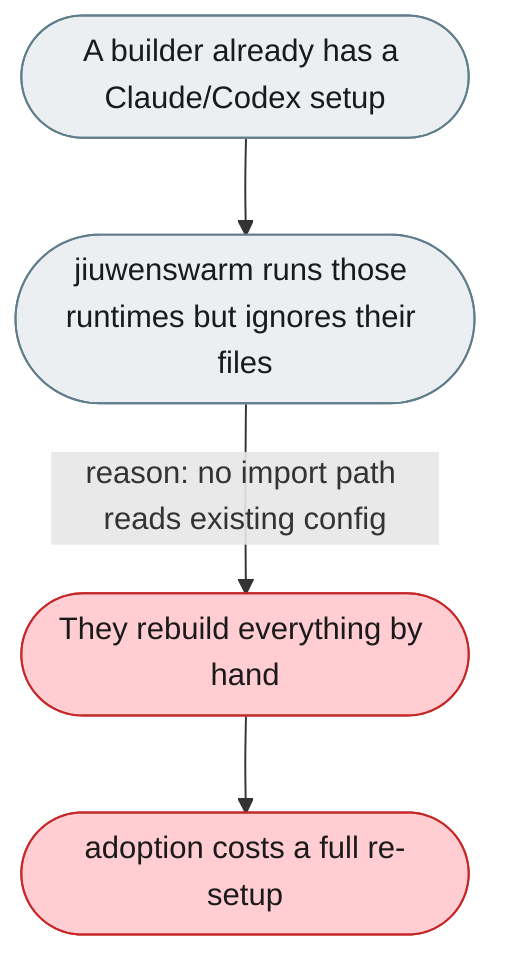
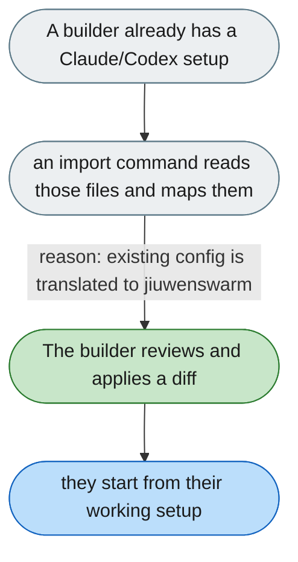

---

# No migration/import path from an existing agent setup

*Concern: Integration & Tooling*

---

## The problem today

jiuwenswarm runs Claude Code and Codex as managed runtimes but never reads their existing files (`CLAUDE.md`, `AGENTS.md`, MCP servers) to help a builder import their setup.

---

## The proposed fix

Add an `import` command that scans for `CLAUDE.md`, `AGENTS.md`, and MCP server definitions, maps them onto jiuwenswarm prompts, memory and MCP config, and produces a reviewed diff before applying.

