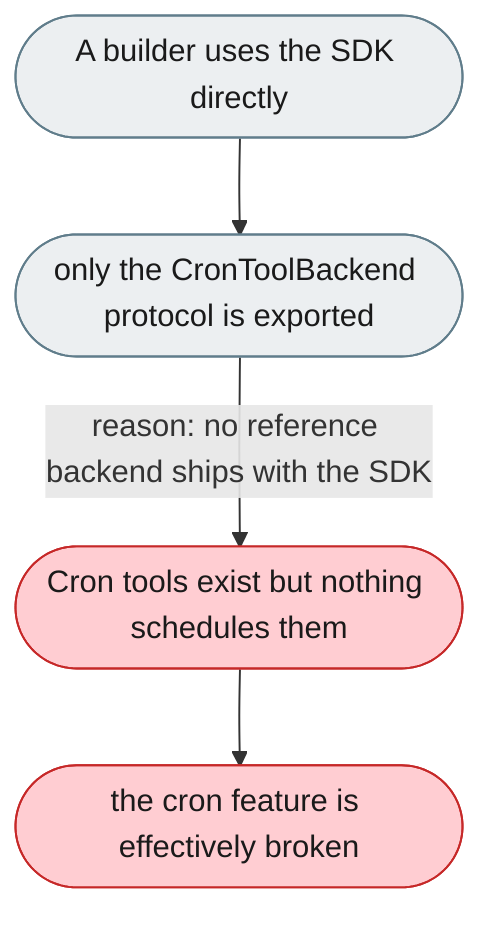
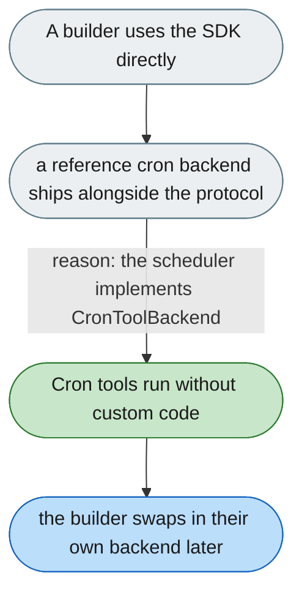

---

# The SDK has no reference cron backend

*Concern: Integration & Tooling*

---

## The problem today

The SDK exposes only the `CronToolBackend` protocol and `create_cron_tools`, so a third party building on the SDK alone gets cron tools the model can call but nothing that actually runs them.

---

## The proposed fix

Ship a reference cron backend with the SDK — a simple scheduler that implements `CronToolBackend`, persists jobs, and executes them — so the protocol is usable out of the box and serves as the template for custom implementations.

