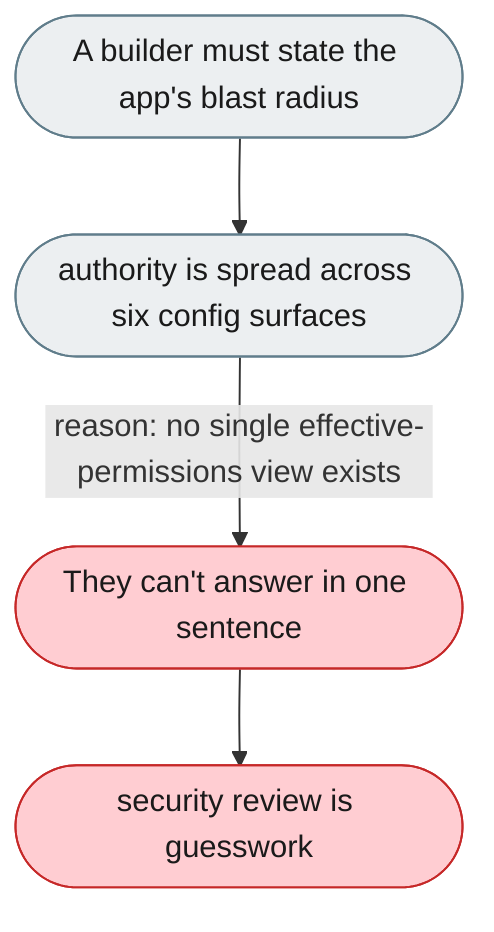

---

# No single answer to what a gateway can reach

*Concern: Connection & Security*

---

## The problem today

Authority is spread across `permissions.tools`, `rules`, `file_guard`, `external_directory`, `owner_scopes` and `approval_overrides`, with per-channel differences. A builder cannot state an app's blast radius in one sentence.



---

## The proposed fix

Add a single effective-permissions resolver that merges all six surfaces (and per-channel overrides) into one computed reach, exposed as a `permissions explain` command and a summary panel, so the blast radius is one answer.

```mermaid
flowchart TD
    classDef fail  fill:#FFCDD2,color:#1a1a1a,stroke:#C62828
    classDef ok    fill:#BBDEFB,color:#1a1a1a,stroke:#1565C0
    classDef fix   fill:#C8E6C9,color:#1a1a1a,stroke:#2E7D32
    classDef plain fill:#ECEFF1,color:#1a1a1a,stroke:#607D8B
    START(["A builder must state the app's blast radius"]):::plain
    MID(["one resolver computes the effective reach"]):::plain
    START --> MID
    MID -->|"reason: all surfaces merge into one result"| OUT(["`permissions explain` states it"]):::fix
    OUT --> DONE(["security review is one sentence"]):::ok
```
