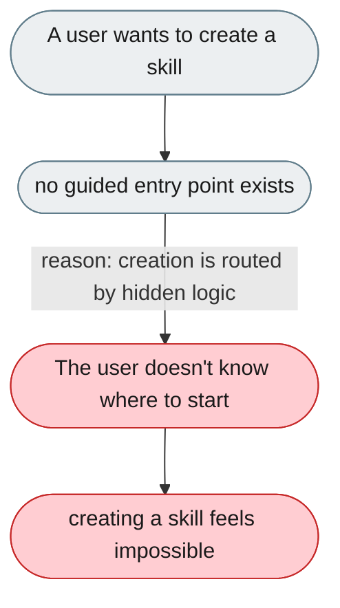
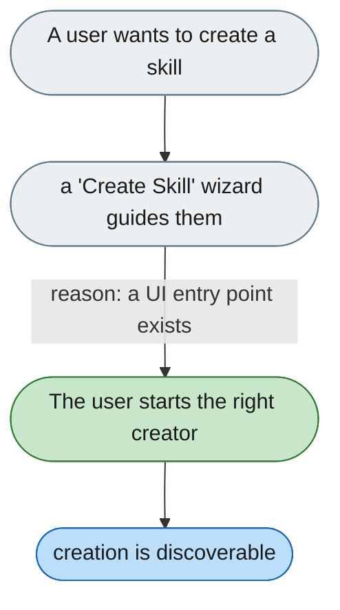

---

# Creating a skill has no clear entry point

*Concern: Skill Authoring & Dependencies*

---

## The problem today

Creating a skill routes between `skill-creator-normal`, `swarmskill-creator`, and `skill-omni-creation` based on chat input, with the routing hidden inside a SKILL.md — no guided UI entry point.

---

## The proposed fix

A "Create Skill" button in the Skills panel opening a short wizard (single-agent / team / from URL) that routes to the right creator with a starter prompt pre-filled.

