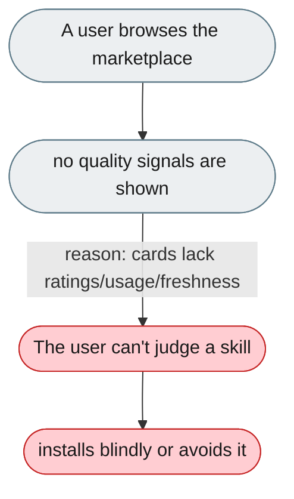
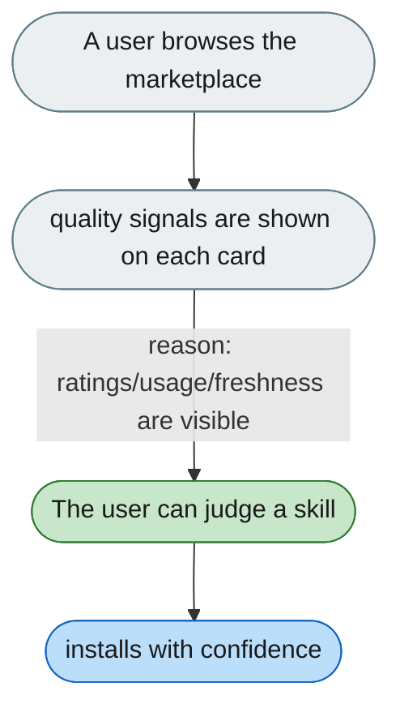

---

# Marketplace shows no ratings, usage or freshness

*Concern: Skill Marketplace*

---

## The problem today

`MarketplacePage.tsx` cards show logo, name, status, install — no ratings, usage, author reputation, or last-updated date, so users can't judge quality before installing.

---

## The proposed fix

On each card: star rating, install count, last-updated date, an author verified badge, a one-paragraph description, and a preview of the SKILL.md.

