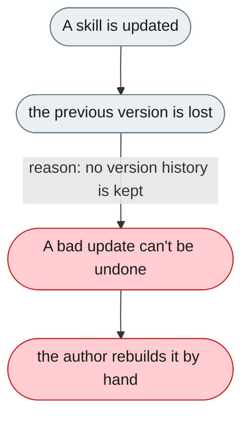
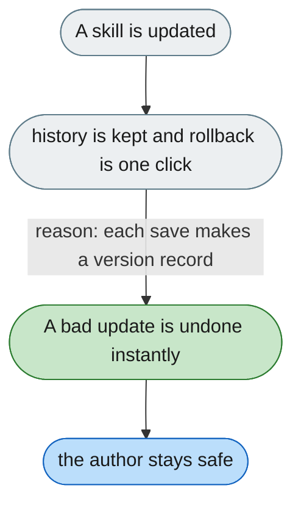

---

# Skill updates can't be reviewed or rolled back

*Concern: Skill Versioning*

---

## The problem today

When a skill is updated (manually or by evolution), the old version isn't kept — a break forces reconstructing the previous SKILL.md.

---

## The proposed fix

Git-style history per skill with one-click rollback; when the evolution system changes a skill, show the diff for approval before committing.

