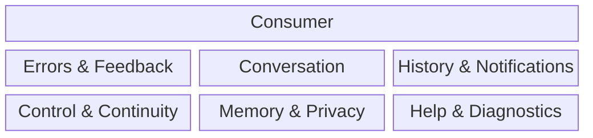

# Consumer

Each box = one concern group.

```mermaid
block-beta
  columns 3
  P["Consumer"]:3
  G1["Errors & Feedback"] G2["Conversation"] G3["History & Notifications"]
  G4["Control & Continuity"] G5["Memory & Privacy"] G6["Help & Diagnostics"]
```

