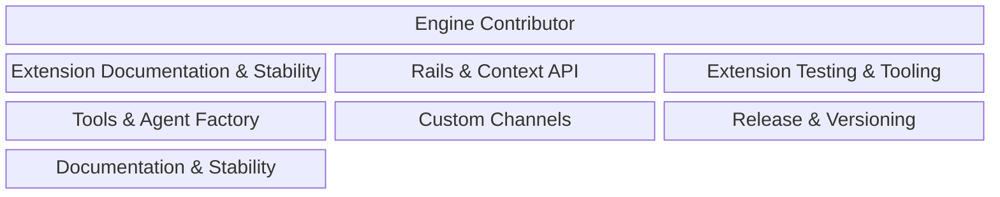

# Engine Contributor

Each box = one concern group.

```mermaid
block-beta
  columns 3
  P["Engine Contributor"]:3
  G1["Extension Documentation & Stability"] G2["Rails & Context API"] G3["Extension Testing & Tooling"]
  G4["Tools & Agent Factory"] G5["Custom Channels"] G6["Release & Versioning"]
  G7["Documentation & Stability"]
```

