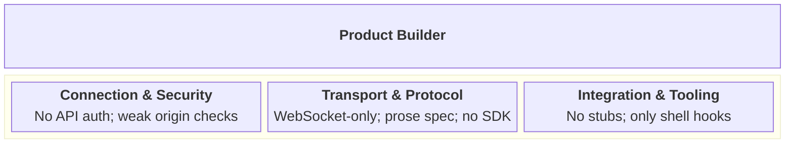

# Product Builder — persona block

Each box: bold group over a short statement of the problem. ≤3 boxes per row.

```mermaid
block-beta
  columns 3
  P["<b>Product Builder</b>"]:3
  block:b0:3
    columns 3
    n1["<b>Connection &amp; Security</b>\nNo API auth; weak origin checks"] n2["<b>Transport &amp; Protocol</b>\nWebSocket-only; prose spec; no SDK"] n3["<b>Integration &amp; Tooling</b>\nNo stubs; only shell hooks"]
  end
```
