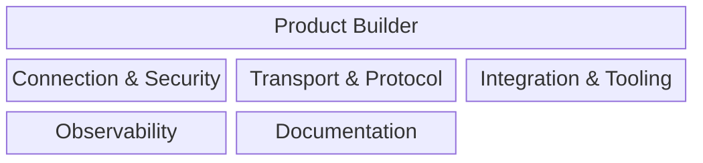

# Product Builder

Each box = one concern group.

```mermaid
block-beta
  columns 3
  P["Product Builder"]:3
  G1["Connection & Security"] G2["Transport & Protocol"] G3["Integration & Tooling"]
  G4["Observability"] G5["Documentation"]
```

