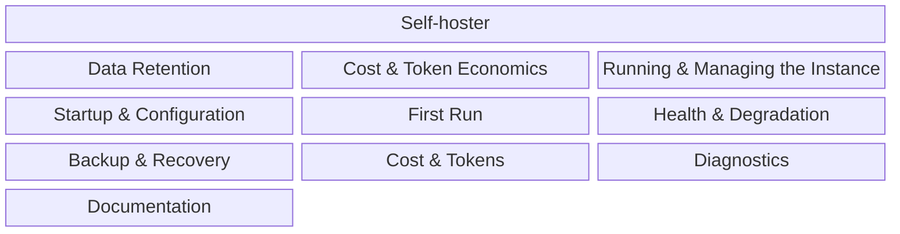

# Self-hoster

Each box = one concern group.

```mermaid
block-beta
  columns 3
  P["Self-hoster"]:3
  G1["Data Retention"] G2["Cost & Token Economics"] G3["Running & Managing the Instance"]
  G4["Startup & Configuration"] G5["First Run"] G6["Health & Degradation"]
  G7["Backup & Recovery"] G8["Cost & Tokens"] G9["Diagnostics"]
  G10["Documentation"]
```

