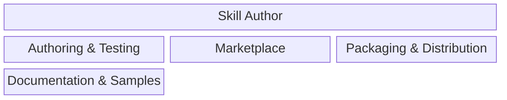

# Skill Author

Each box = one concern group.

```mermaid
block-beta
  columns 3
  P["Skill Author"]:3
  G1["Authoring & Testing"] G2["Marketplace"] G3["Packaging & Distribution"]
  G4["Documentation & Samples"]
```

