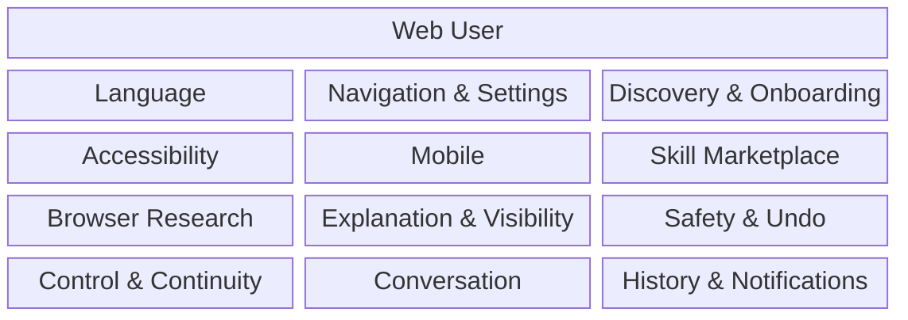

# Web User

Each box = one concern group.

```mermaid
block-beta
  columns 3
  P["Web User"]:3
  G1["Language"] G2["Navigation & Settings"] G3["Discovery & Onboarding"]
  G4["Accessibility"] G5["Mobile"] G6["Skill Marketplace"]
  G7["Browser Research"] G8["Explanation & Visibility"] G9["Safety & Undo"]
  G10["Control & Continuity"] G11["Conversation"] G12["History & Notifications"]
```

