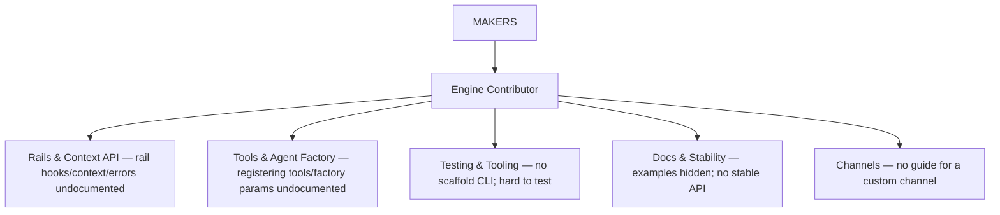
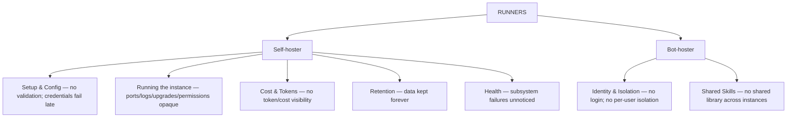
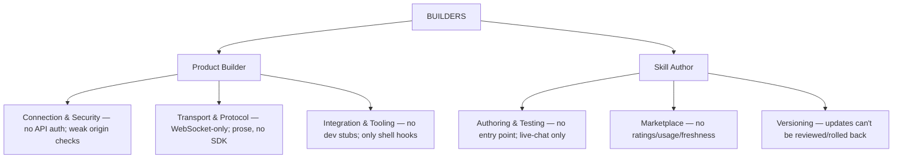

# Personas — the tree (pillars → personas → finding groups)

Each persona's finding **groups are explained** on the leaf. A descendant inherits its ancestor's groups; it only lists its own here.

## Indented tree

```
jiuwenswarm people
├─ 0 · MAKERS
│  └─ Engine Contributor
│     ├─ Rails & Context API — rail hooks, context & errors are undocumented
│     ├─ Tools & Agent Factory — registering tools & factory params is undocumented
│     ├─ Testing & Tooling — no scaffold CLI; rails are hard to test
│     ├─ Docs & Stability — examples hidden; no stable public API
│     └─ Channels — no guide for writing a custom channel
│
├─ 1 · RUNNERS
│  ├─ Self-hoster
│  │  ├─ Setup & Config — no validation; credentials fail late
│  │  ├─ Running the instance — ports/logs/upgrades/permissions are opaque
│  │  ├─ Cost & Tokens — no token or cost visibility
│  │  ├─ Retention — data is kept forever
│  │  └─ Health — subsystem failures go unnoticed
│  └─ Bot-hoster
│     ├─ Identity & Isolation — no login; no per-user isolation
│     └─ Shared Skills — no shared library across instances
│
├─ 2 · CONSUMERS
│  └─ Consumer  (base — everyone inherits this)
│     ├─ Errors & Feedback — unactionable errors; can't correct the agent
│     ├─ Conversation — unclear context in replies and clarification
│     ├─ History & Notifications — no search or task-finished notice
│     ├─ Control & Continuity — crashes and disconnects lose work
│     ├─ Memory & Privacy — can't see what's remembered or sent
│     └─ Help & Diagnostics — no guidance or easy diagnostics
│     ├─ Web User  (a Consumer)
│     │  ├─ Choosing — mode names are unclear
│     │  ├─ Language — GUI isn't fully translated
│     │  ├─ Navigation & Settings — settings by module; skills/connectors split
│     │  ├─ Discovery — empty start; powerful features hidden
│     │  ├─ Accessibility — contrast & screen-reader gaps
│     │  └─ Mobile — not mobile-friendly; no offline app
│     │  ├─ Web Chat (Consumer → Web User)
│     │  │  ├─ Reply — no control over length or writing style
│     │  │  └─ Sharing — conversations only as a flat image
│     │  └─ Web Code (Consumer → Web User)
│     │     ├─ Explanation — can't see reasoning or why a tool ran
│     │     ├─ Safety & Undo — changes apply without preview; hard to undo
│     │     ├─ Progress — long builds show no progress
│     │     └─ Keyboard — not fully keyboard-driven
│     ├─ Text User (a Consumer)  [TBD]
│     │  ├─ CLI — not built yet
│     │  ├─ TUI — not built yet
│     │  └─ IM — not built yet
│     └─ Channel User (a Consumer) [TBD]
│        ├─ Browser — not built yet
│        └─ IDE — not built yet
│
└─ 3 · BUILDERS
   ├─ Product Builder
   │  ├─ Connection & Security — no API auth; weak origin checks
   │  ├─ Transport & Protocol — WebSocket-only; prose spec, no SDK
   │  └─ Integration & Tooling — no dev stubs; only shell hooks
   └─ Skill Author
      ├─ Authoring & Testing — no entry point; only live-chat testing
      ├─ Marketplace — no ratings, usage or freshness
      └─ Versioning — updates can't be reviewed or rolled back
```

## Mermaid — one vertical diagram per pillar

Each diagram is independent and drawn top→down, so no single one is wide.

### MAKERS



### RUNNERS



### CONSUMERS

```mermaid
flowchart TD
  K[CONSUMERS]
  K --> C["Consumer · base"]
  C --> CE1["Errors & Feedback — unactionable; can't correct"]
  C --> CE2["Conversation — unclear context in replies"]
  C --> CE3["History & Notifications — no search or finish notice"]
  C --> CE4["Control & Continuity — crashes/disconnects lose work"]
  C --> CE5["Memory & Privacy — can't see remembered/sent data"]
  C --> CE6["Help & Diagnostics — no guidance or easy diagnostics"]
  C --> WU["Web User · a Consumer"]
  WU --> WU1["Choosing — mode names unclear"]
  WU --> WU2["Language — GUI not fully translated"]
  WU --> WU3["Navigation & Settings — settings by module; split"]
  WU --> WU4["Discovery — empty start; features hidden"]
  WU --> WU5["Accessibility — contrast & screen-reader gaps"]
  WU --> WU6["Mobile — not mobile-friendly; no offline app"]
  WU --> WC["Web Chat"]
  WC --> WCR["Reply — no length/style control"]
  WC --> WCS["Sharing — flat image only"]
  WU --> WK["Web Code"]
  WK --> WKE["Explanation — can't see reasoning/why a tool ran"]
  WK --> WKS["Safety & Undo — no preview; hard to undo"]
  WK --> WKP["Progress — long builds no progress"]
  WK --> WKK["Keyboard — not fully keyboard-driven"]
  C --> TU["Text User · TBD"]
  TU --> CLI["CLI — not built yet"]
  TU --> TUI["TUI — not built yet"]
  TU --> IM["IM — not built yet"]
  C --> CU["Channel User · TBD"]
  CU --> BR["Browser — not built yet"]
  CU --> ID["IDE — not built yet"]
```



### BUILDERS



## Render

Paste any Mermaid block into GitHub / VS Code (Mermaid extension) / Obsidian, or export each to an image with mermaid-cli.
